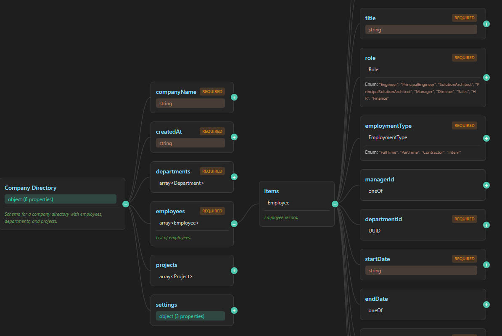
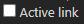

# JSON Schema Viewer VS Code plugin

A VS Code extension to visualize JSON Schema files in an interactive, expandable tree view very similar to the "OpenApi Editor".

## Features

- **Interactive Tree Views**: View JSON schemas in 2 different collapsible tree structures
- **Property Details**: See types, descriptions, constraints, and examples
- **Required Fields**: Clearly marked required properties
- **Definition Support**: Expands `$ref` references to definitions
- **Live Updates**: Schema view updates as you edit
- **Dark/Light Theme**: Adapts to your VS Code theme
- **Active Link support**: Enables the user to click on an item in any of the visual views to navigate to the corresponding item in the JSON Schema file

### Example screenshot

This is an example of how the plugin looks in VS Code in the 2 views (Normal & Tree view).

#### Normal view
Displays the JSON schema in a view similar to the OpenAPI visualization

#### Tree view
Displays the JSON schema in a collapsible tree view

#### Normal/Tree view Toggle
Use the **toggle** in the top right of the header to switch between the modes

#### Active link
Use the **Active link** checkbox to enable the active link feature where the cursor in the code editor will navigate to the item you click on in the visualization views

## Usage

For more info on how to use this plugin see this page [usage info](docs/usage.md)

## Detailed info

For more detailed developer info on this plugin see this page [detailed info](docs/index.md)
