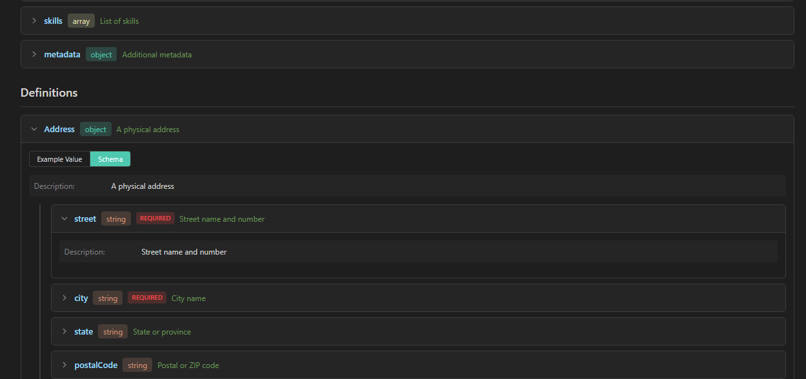

# JSON Schema Viewer VS Code plugin

A VS Code extension to visualize JSON Schema files in an interactive, expandable tree view.

## Features

- **Interactive Tree View**: View JSON schemas in a collapsible tree structure
- **Property Details**: See types, descriptions, constraints, and examples
- **Required Fields**: Clearly marked required properties
- **Definition Support**: Expands `$ref` references to definitions
- **Live Updates**: Schema view updates as you edit
- **Dark/Light Theme**: Adapts to your VS Code theme

### Example screenshot

This is an example of how the plugin looks in VS Code.

## Usage

For more info on how to use this plugin see this page [usage info](docs/usage.md)

## Installation

More info on how you install this VS Code extension can be found in the [installation guide](docs/installation.md).

## Technical info

More info on the technical details of this VS Code extension can be found [here](docs/TechnicalInfo.md).
