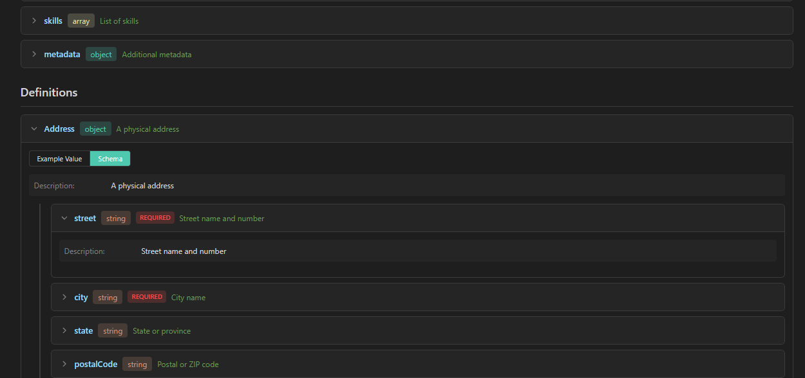

# Usage of this VS Code plugin## Usage

1. Open a JSON Schema file (`.json`)
2. Use one of these methods to preview:
   - Click the **Preview** icon in the editor title bar
   - Right-click and select **Preview JSON Schema**
   - Use keyboard shortcut: `Shift+Alt+P`
   - Open Command Palette (`Ctrl+Shift+P`) and run **Preview JSON Schema**

## Example screenshot

This is an example of how the plugin looks in VS Code.

## Supported Schema Features

- `properties` - Object properties
- `required` - Required field indicators
- `definitions` / `$defs` - Schema definitions
- `$ref` - Reference resolution
- `type` - All JSON Schema types
- `enum` - Enumeration values
- `format` - String formats
- `pattern` - Regex patterns
- `minimum` / `maximum` - Number constraints
- `minLength` / `maxLength` - String length constraints
- `minItems` / `maxItems` - Array size constraints
- `default` - Default values
- `example` - Example values
- `oneOf` / `anyOf` / `allOf` - Schema composition
- `items` - Array item schemas
